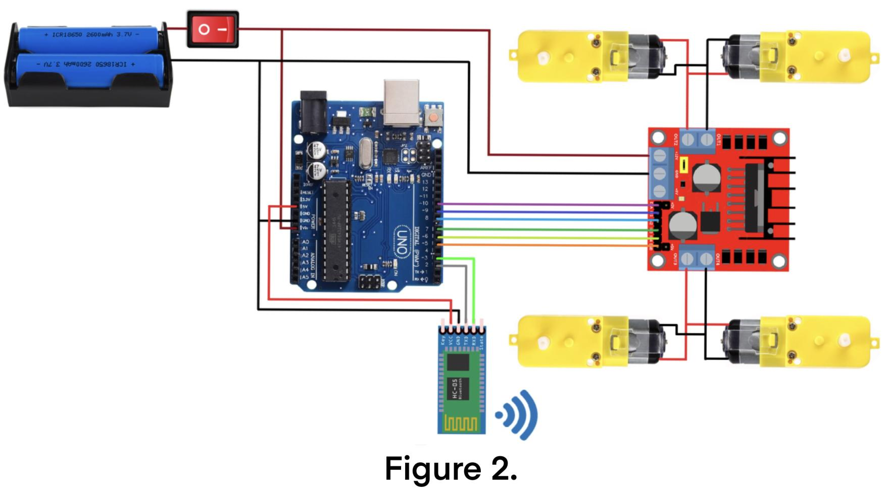
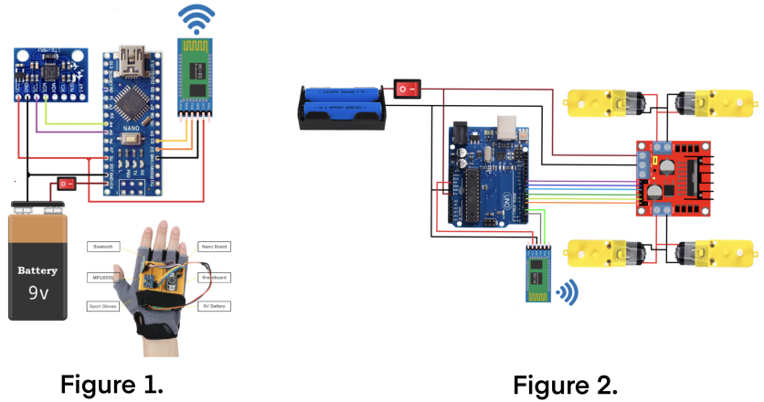

# Hand Gesture Control Robot Via Bluetooth
<!---Replace this text with a brief description (2-3 sentences) of your project. This description should draw the reader in and make them interested in what you've built. You can include what the biggest challenges, takeaways, and triumphs from completing the project were. As you complete your portfolio, remember your audience is less familiar than you are with all that your project entails!-->
<!---Brief Description Here--->
This summer I worked to build a robotic car wirelessly controlled by the gestures of your hand. This project was a heavy focus on the electrical engineering side with aspects of mechanical engineering and computer science. The failures along the road, such as the battery exploding, taught me so much on how to think quick on my feet. I learned how much I loved the hands on aspect and the precise nature of certain things like soldering. Building this robot has further my loved for engineering and computer science alike and I know I’ll be pursing more projects like this soon. 

<!--- You should comment out all portions of your portfolio that you have not completed yet, as well as any instructions: -->
<!--- ```HTML 
<!--- This is an HTML comment in Markdown -->
<!--- Anything between these symbols will not render on the published site -->
<!--- ``` -->

| **Engineer** | **School** | **Area of Interest** | **Grade** |
|:--:|:--:|:--:|:--:|
| Michelle W. | The Bronx High School of Science | Computer Science | Senior

<!--- **Replace the BlueStamp logo below with an image of yourself and your completed project. Follow the guide [here](https://tomcam.github.io/least-github-pages/adding-images-github-pages-site.html) if you need help.** -->

<br> 

  
# Final Milestone

<iframe width="560" height="315" src="https://www.youtube.com/embed/vtfEFqU-Zyg" title="YouTube video player" frameborder="0" allow="accelerometer; autoplay; clipboard-write; encrypted-media; gyroscope; picture-in-picture; web-share" allowfullscreen></iframe>

<!--- 
For your final milestone, explain the outcome of your project. Key details to include are:
- What you've accomplished since your previous milestone
- What your biggest challenges and triumphs were at BSE
- A summary of key topics you learned about
- What you hope to learn in the future after everything you've learned at BSE -->

  For my final milestone, I achieved wireless control of the robot car by combining the functionalities of milestones 1 and 2. To integrate both parts, I configured the Bluetooth modules, using the "Bluetooth Configuring Code" below, to establish a connection between the gesture controller and the robot car. This involved setting up the gesture controller as the control device and the robot car as the peripheral. Through the serial monitor, I input commands like "AT+UART" and "AT+ROLE" to adjust baud rates, roles, and other settings.

  Once the Bluetooth modules were paired, I re-uploaded the "Gesture Controller Code" and "Robot Car Code" to their respective Arduinos, removing any connecting wires in the process and connecting to their 9-volt power sources. With the successful pairing, the robot car became fully controllable through the wireless gesture controller without any physical connections.
  

# Second Milestone

<!--- **Don't forget to replace the text below with the embedding for your milestone video. Go to Youtube, click Share -> Embed, and copy and paste the code to replace what's below.** -->

<iframe width="560" height="315" src="https://www.youtube.com/embed/9yI4P5sxWMo" title="YouTube video player" frameborder="0" allow="accelerometer; autoplay; clipboard-write; encrypted-media; gyroscope; picture-in-picture; web-share" allowfullscreen></iframe>

<!--- 
For your second milestone, explain what you've worked on since your previous milestone. You can highlight:
- Technical details of what you've accomplished and how they contribute to the final goal
- What has been surprising about the project so far
- Previous challenges you faced that you overcame
- What needs to be completed before your final milestone -->

  For my second milestone, I successfully completed all the necessary wiring and additionally assembled the robot car, involving an Arduino Uno, a motor driver, a Bluetooth module, and 6 battery packs. To allow for a 9-volt power supply, I connected the battery packs in series and connected them alongside the wires on the four motors to the motor driver, following Figure 2 in the "Schematics" below.

  However, during the setup, I experienced a setback when one of the batteries encountered a short circuit, causing it to pop. For safety reasons, I had to replace the entire battery pack and the motor driver as a precaution. This required me to redo all the related wiring and soldering to ensure that my wiring wouldn't cause any more issues.

  Luckily, afterwards, everything seemed to be in good shape, so we were finally able to test the motors with a basic test code (provided below called "Motor Test Code) to ensure they were functioning correctly before uploading the full actual code. Following a few additional minor adjustments, the car was capable of moving in all four directions

# First Milestone

<iframe width="560" height="315" src="https://www.youtube.com/embed/YDUDkDlO_pc" title="YouTube video player" frameborder="0" allow="accelerometer; autoplay; clipboard-write; encrypted-media; gyroscope; picture-in-picture; web-share" allowfullscreen></iframe>


  In my first milestone, I worked with the Arduino Micro and an accelerometer as my main components to establish a reliable and accurate connection. Initially, I wired the breadboard according to Figure 1 in "Schematics" below. However, immediately upon attempting to retrieve data from the serial monitor, I encountered a consistent timeout message indicating an inability to establish a connection.

  Further research helped us realize that the schematic I followed was intended for an Arduino Nano (figure 1 on the left), whereas I was using an Arduino Micro (figure 2 on the right). Fortunately, this was an easy fix and I compared the pinouts of the two boards, making the necessary adjustments to my wiring. The biggest issue being that certain pins overlapped, forcing me to modify certain pin numbers in my code. 

  I encountered no further issues as I reconnected the Arduino to the power source, opened up the serial monitor once more, and was able to obtain consistent and updated values for X, Y, and Z from the accelerometer (code provided below called "Gesture Controller Code"). The X and Y values would be used to detect specific gestures (forward, backward, left, or right) and subsequently, the corresponding commands would be sent to the Bluetooth module, allowing me to be able to control the robot car in the near future.
  
# Schematics 
<!---
<html>
<head>
  <title>Schematics</title>
</head>
<body>




</body>
</html>
-->

<!---
 
 
-->



# Code

Gesture Controller Code:
```c++
#include <SoftwareSerial.h>
SoftwareSerial BT_Serial(7, 8); // RX, TX

#include <Wire.h> // I2C communication library

const int MPU = 0x68; // I2C address of the MPU6050 accelerometer
int16_t AcX, AcY, AcZ;

int flag=0;

void setup () {// put your setup code here, to run once

Serial.begin(38400); // start serial communication at 38400bps
BT_Serial.begin(38400); 

// Initialize interface to the MPU6050
Wire.begin();
Wire.beginTransmission(MPU);
Wire.write(0x6B);
Wire.write(0);
Wire.endTransmission(true);

delay(500); 
}

void loop () {
Read_accelerometer(); // Read MPU6050 accelerometer

if(AcX<60  && flag==0){flag=1; BT_Serial.write('f');}
if(AcX>130 && flag==0){flag=1; BT_Serial.write('b');}
      
if(AcY<60  && flag==0){flag=1; BT_Serial.write('l'); }
if(AcY>130 && flag==0){flag=1; BT_Serial.write('r');}
  
if((AcX>70)&&(AcX<120)&&(AcY>70)&&(AcY<120)&&(flag==1)){flag=0;
BT_Serial.write('s');
}

delay(100);  
}

void Read_accelerometer(){
      // Read the accelerometer data
Wire.beginTransmission(MPU);
Wire.write(0x3B); // Start with register 0x3B (ACCEL_XOUT_H)
Wire.endTransmission(false);
Wire.requestFrom(MPU, 6, true); // Read 6 registers total, each axis value is stored in 2 registers

AcX = Wire.read() << 8 | Wire.read(); // X-axis value
AcY = Wire.read() << 8 | Wire.read(); // Y-axis value
AcZ = Wire.read() << 8 | Wire.read(); // Z-axis value

AcX = map(AcX, -17000, 17000, 0, 180);
AcY = map(AcY, -17000, 17000, 0, 180);
AcZ = map(AcZ, -17000, 17000, 0, 180);

Serial.print(AcX);
Serial.print("\t");
Serial.print(AcY);
Serial.print("\t");
Serial.println(AcZ); 
}
```

Motor Test Code:
```c++
const int in1 = 9;
const int in2 = 8;
const int in3 = 7;
const int in4 = 6;
const int enA = 5;
const int enB = 10;


void setup() {
  pinMode(in1, OUTPUT);
  pinMode(in2, OUTPUT);
  pinMode(in3, OUTPUT);
  pinMode(in4, OUTPUT);
  pinMode(enA, OUTPUT);
  pinMode(enB, OUTPUT);

  digitalWrite(enA, HIGH);
  digitalWrite(enB, HIGH);
}

void loop() {
  moveForward();
  delay(2000);
  stopMove();
  delay(500);

  moveBackward();
  delay(2000);
  stopMove();
  delay(500);

  turnLeft();
  delay(2000);
  stopMove();
  delay(500);

  turnRight();
  delay(2000);
  stopMove();
  delay(500);
}

void moveForward() {
  digitalWrite(in1, LOW);
  digitalWrite(in2, HIGH);
  digitalWrite(in3, HIGH);
  digitalWrite(in4, LOW);
}

void moveBackward() {
  digitalWrite(in1, HIGH);
  digitalWrite(in2, LOW);
  digitalWrite(in3, LOW);
  digitalWrite(in4, HIGH);
}

void turnRight() {
  digitalWrite(in1, HIGH);
  digitalWrite(in2, LOW);
  digitalWrite(in3, HIGH);
  digitalWrite(in4, LOW);
}

void turnLeft() {
  digitalWrite(in1, LOW);
  digitalWrite(in2, HIGH);
  digitalWrite(in3, LOW);
  digitalWrite(in4, HIGH);
}

void stopMove() {
  digitalWrite(in1, LOW);
  digitalWrite(in2, LOW);
  digitalWrite(in3, LOW);
  digitalWrite(in4, LOW);
}
```

Bluetooth Configuring Code from: Kebba Jammeh
```c++
// sets up the Bluetooth Module for the Uno
// This is for the Arduino Uno
// Set up the first bluetooth module

#include <SoftwareSerial.h>

#define tx 7
#define rx 8

SoftwareSerial configBt(rx, tx);

void setup()
{
  Serial.begin(38400);
  configBt.begin(38400);
  pinMode(tx, OUTPUT);
  pinMode(rx, INPUT);
}

void loop()
{
  if (configBt.available())
  {
    Serial.print((char)configBt.read());
  }
  if (Serial.available())
  {
    configBt.write(Serial.read());
  }
}
```

Robot Car Code:
```c++
#include <SoftwareSerial.h>
SoftwareSerial BT_Serial(2, 3); // RX, TX

#define enA 10//Enable1 L298 Pin enA 
#define in1 9 //Motor1  L298 Pin in1 
#define in2 8 //Motor1  L298 Pin in1 
#define in3 7 //Motor2  L298 Pin in1 
#define in4 6 //Motor2  L298 Pin in1 
#define enB 5 //Enable2 L298 Pin enB 

char bt_data; // variable to receive data from the serial port
int Speed = 150; //Write The Duty Cycle 0 to 255 Enable Pins for Motor Speed  

void setup() { // put your setup code here, to run once

Serial.begin(38400); // start serial communication at 9600bps
BT_Serial.begin(38400); 

pinMode(enA, OUTPUT); // declare as output for L298 Pin enA 
pinMode(in1, OUTPUT); // declare as output for L298 Pin in1 
pinMode(in2, OUTPUT); // declare as output for L298 Pin in2 
pinMode(in3, OUTPUT); // declare as output for L298 Pin in3   
pinMode(in4, OUTPUT); // declare as output for L298 Pin in4 
pinMode(enB, OUTPUT); // declare as output for L298 Pin enB 

delay(200);
}
void loop(){
if(BT_Serial.available() > 0){  //if some date is sent, reads it and saves in state     
bt_data = BT_Serial.read(); 
Serial.println(bt_data);          
}
  
     if(bt_data == 'f'){forword();  Speed=180;}  // if the bt_data is 'f' the DC motor will go forward
else if(bt_data == 'b'){backword(); Speed=180;}  // if the bt_data is 'b' the motor will Reverse
else if(bt_data == 'l'){turnLeft(); Speed=250;}  // if the bt_data is 'l' the motor will turn left
else if(bt_data == 'r'){turnRight();Speed=250;} // if the bt_data is 'r' the motor will turn right
else if(bt_data == 's'){Stop(); }     // if the bt_data 's' the motor will Stop

analogWrite(enA, Speed); // Write The Duty Cycle 0 to 255 Enable Pin A for Motor1 Speed 
analogWrite(enB, Speed); // Write The Duty Cycle 0 to 255 Enable Pin B for Motor2 Speed 

delay(50);
}

void forword(){  //forword
digitalWrite(in1, HIGH); //Right Motor forword Pin 
digitalWrite(in2, LOW);  //Right Motor backword Pin 
digitalWrite(in3, LOW);  //Left Motor backword Pin 
digitalWrite(in4, HIGH); //Left Motor forword Pin 
}

void backword(){ //backword
digitalWrite(in1, LOW);  //Right Motor forword Pin 
digitalWrite(in2, HIGH); //Right Motor backword Pin 
digitalWrite(in3, HIGH); //Left Motor backword Pin 
digitalWrite(in4, LOW);  //Left Motor forword Pin 
}

void turnRight(){ //turnRight
digitalWrite(in1, LOW);  //Right Motor forword Pin 
digitalWrite(in2, HIGH); //Right Motor backword Pin  
digitalWrite(in3, LOW);  //Left Motor backword Pin 
digitalWrite(in4, HIGH); //Left Motor forword Pin 
}

void turnLeft(){ //turnLeft
digitalWrite(in1, HIGH); //Right Motor forword Pin 
digitalWrite(in2, LOW);  //Right Motor backword Pin 
digitalWrite(in3, HIGH); //Left Motor backword Pin 
digitalWrite(in4, LOW);  //Left Motor forword Pin 
}

void Stop(){ //stop
digitalWrite(in1, LOW); //Right Motor forword Pin 
digitalWrite(in2, LOW); //Right Motor backword Pin 
digitalWrite(in3, LOW); //Left Motor backword Pin 
digitalWrite(in4, LOW); //Left Motor forword Pin 
}
```

# Bill of Materials
<!--- Here's where you'll list the parts in your project. To add more rows, just copy and paste the example rows below.
Don't forget to place the link of where to buy each component inside the quotation marks in the corresponding row after href =. Follow the guide [here]([url](https://www.markdownguide.org/extended-syntax/)) to learn how to customize this to your project needs. 
| Item Name | What the item is used for | $Price | <a href=""> Link </a> |
-->

| **Part** | **Note** | **Price** | **Link** |
|:--:|:--:|:--:|:--:|
| MakerFocus DIY Robot Car Smart Chassis Kit | Robot Car Structure | $17.99 | <a href="https://www.amazon.com/MakerFocus-Chassis-MEGA2560-MEGA1280-Microcontroller/dp/B01LYZDP9U"> Link </a> |
| Soldering Iron Kit | Soldering Tools | $19.99 | <a href="https://www.amazon.com/Soldering-Iron-Kit-Temperature-Desoldering/dp/B07S61WT16/ref=sr_1_5?crid=JYHIJ8VXUJGP&keywords=soldering+iron+kit+plusivo&qid=1689658857&sprefix=soldering+iron+kit+plu%2Caps%2C87&sr=8-5"> Link </a> |
| ELEGOO UNO R3 Board | Arduino Uno | $16.99 | <a href="https://www.amazon.com/ELEGOO-Board-ATmega328P-ATMEGA16U2-Compliant/dp/B01EWOE0UU/ref=sr_1_1_sspa?crid=3ECSRESJSZJEC&keywords=elegoo+uno+r3&qid=1689866368&sprefix=elegoo+uno%2Caps%2C88&sr=8-1-spons&sp_csd=d2lkZ2V0TmFtZT1zcF9hdGY&psc=1"> Link </a> |
| Arduino Micro with Headers | Arduino Micro | $17.99 | <a href="https://www.amazon.com/Arduino-Micro-Headers-A000053-Controller/dp/B00AFY2S56/ref=sr_1_3?crid=NGC15B4U6BJM&keywords=arduino+micro+with+headers&qid=1689866415&sprefix=arduino+micro+wit%2Caps%2C93&sr=8-3"> Link </a> |
| 2 DSD TECH HC-05 Bluetooth Serial Pass-Through Module Wireless | Wireless connection | $9.99 | <a href="https://www.amazon.com/DSD-TECH-HC-05-Pass-through-Communication/dp/B01G9KSAF6/ref=sr_1_1_sspa?crid=35ZXFJU8T3XDX&keywords=DSD+TECH+HS-05+Bluetooth+serial+pass&qid=1689866756&sprefix=dsd+tech+hs-05+bluetooth+serial+pass%2Caps%2C85&sr=8-1-spons&sp_csd=d2lkZ2V0TmFtZT1zcF9hdGY&psc=1"> Link </a> |
| HiLetgo 3pcs GY-521 MPU-6050 3 Axis Accelerometer | Reads acceleration data | $9.99 | <a href="https://www.amazon.com/HiLetgo-MPU-6050-Accelerometer-Gyroscope-Converter/dp/B00LP25V1A/ref=sr_1_1_sspa?crid=KA75HC0KQUF3&keywords=hiletgo%2B3pcs%2Bgy-521%2Bmpu-6050&qid=1689866854&sprefix=Hlletgo%2B3pcs%2BGY%2Caps%2C83&sr=8-1-spons&sp_csd=d2lkZ2V0TmFtZT1zcF9hdGY&th=1"> Link </a> |
| HiLetgo 4pcs L298N Motor Driver Controller Board Module | Controls the motors | $11.49 | <a href="https://www.amazon.com/HiLetgo-Controller-Stepper-H-Bridge-Mega2560/dp/B07BK1QL5T/ref=sr_1_3?crid=I1J9CKWM3I6H&keywords=HiLetgo+4pcs+L298N+Motor+Driver+Controller+Board+Module&qid=1689867084&sprefix=hiletgo+4pcs+l298n+motor+driver+controller+board+module%2Caps%2C85&sr=8-3"> Link </a> |
| DEYUE Solderless Prototype Breadboard | Electrical connections | $8.59 | <a href="https://www.amazon.com/DEYUE-Solderless-Prototype-Breadboard-breadboard/dp/B07DMHVC3R/ref=sr_1_3?crid=3NEVXLOZ9DP5W&keywords=DEYUE+solderless+prototype+breadboard&qid=1689867255&sprefix=deyue+solderless+prototype+breadboard%2Caps%2C74&sr=8-3"> Link </a> |
| EDGELEC 120pcs Breadboard Jumper Wires 20cm | Wires | $6.99 | <a href="https://www.amazon.com/EDGELEC-Breadboard-Optional-Assorted-Multicolored/dp/B07GD2BWPY/ref=sr_1_1_sspa?crid=11DRWA4D64HY9&keywords=jumper+wires&qid=1689867346&sprefix=jumoper+wires%2Caps%2C90&sr=8-1-spons&sp_csd=d2lkZ2V0TmFtZT1zcF9hdGY&psc=1"> Link </a> |
| AUSTOR 560 Pieces Jumper Wire Kit 14 Lengths | Wires | $11.99 | <a href="https://www.amazon.com/AUSTOR-Lengths-Assorted-Preformed-Breadboard/dp/B07CJYSL2T/ref=sr_1_3?crid=294YD6JGLPLIB&keywords=austor+560+pieces+jumper+wire+kit+14+lengths+assorted&qid=1689867486&sprefix=AUSTOR+56%2Caps%2C89&sr=8-3"> Link </a> |
| Etekcity Digital Multimeter | Measure electrical values | $12.49 | <a href="https://www.amazon.com/Etekcity-Multimeter-MSR-R500-Electronic-Multimeters/dp/B01N9QW620/ref=sr_1_5?crid=2E17GSECMR5OS&keywords=Etekcity+Digital+Multimeter&qid=1689868603&sprefix=etekcity+digital+multimeter%2Caps%2C93&sr=8-5"> Link </a> |
| MYFON Micro USB Cable 2 Pack 6FT | Connection | $4.99 | <a href="https://www.amazon.com/Charging-Transfer-Android-Trustable-MYFON/dp/B098DW7485/ref=sr_1_3?crid=VCL054393Y55&keywords=MYFON+micro+usb+cable&qid=1689868449&sprefix=myfon+micro+usb+cable%2Caps%2C96&sr=8-3"> Link </a> |
| 8 Pack AA Battery Holder Bundle | Battery Holder | $6.99 | <a href="https://www.amazon.com/Pack-Battery-Holder-Bundle-QTEATAK/dp/B07WY3VMNN/ref=sr_1_3?crid=1OF3CIMGIZA6S&keywords=8+pack+AA+battery+holder+bundle&qid=1689867733&sprefix=8+pack+aa+battery+holder+bundle%2Caps%2C90&sr=8-3"> Link </a> |
| Amazon Basics 20-Pack AA Alkaline Batteries 1.5 Volt | Power Supply | $9.70 | <a href="https://www.amazon.com/AmazonBasics-Performance-Alkaline-Batteries-20-Pack/dp/B00NTCH52W/ref=sr_1_1_ffob_sspa?crid=29DONK02H9DWW&keywords=amazon+basics+20+pack+AA&qid=1689867800&sprefix=amazon+basics+20+pack+aa+%2Caps%2C84&sr=8-1-spons&sp_csd=d2lkZ2V0TmFtZT1zcF9hdGY&psc=1"> Link </a> |
| Eclipse Tools CP-301G Pro'sKit Precision Wire Stripper, 30-20 AWG | Stripping Wires | $6.99 | <a href="https://www.amazon.com/Eclipse-CP-301G-ProsKit-Precision-Stripper/dp/B005JVJDIA/ref=sr_1_2?crid=281MGPHBPAVHH&keywords=eclipse+tools+cp-301g+pro%27skit+precision+wire+stripper%2C+30-20+awg&qid=1689867943&sprefix=eclipse+tools+%2Caps%2C87&sr=8-2"> Link </a> |
| 32 In 1 Small Screwdriver Set 30 Bits | Screwdriver | $8.89| <a href="https://www.amazon.com/Small-Screwdriver-Set-Mini-Magnetic/dp/B08RYXKJW9/ref=sr_1_1_sspa?crid=PDEKV2OTFZ1W&keywords=32%2Bin%2B1%2Bsmall%2Bscrewdriver%2Bset&qid=1689868065&sprefix=32%2Bin%2B1%2Bsmall%2B%2Caps%2C91&sr=8-1-spons&sp_csd=d2lkZ2V0TmFtZT1zcF9hdGY&th=1"> Link </a> |

<!--- Other Resources/Examples
One of the best parts about Github is that you can view how other people set up their own work. Here are some past BSE portfolios that are awesome examples. You can view how they set up their portfolio, and you can view their index.md files to understand how they implemented different portfolio components.
- [Example 1](https://trashytuber.github.io/YimingJiaBlueStamp/)
- [Example 2](https://sviatil0.github.io/Sviatoslav_BSE/)
- [Example 3](https://arneshkumar.github.io/arneshbluestamp/)

To watch the BSE tutorial on how to create a portfolio, click here. -->
