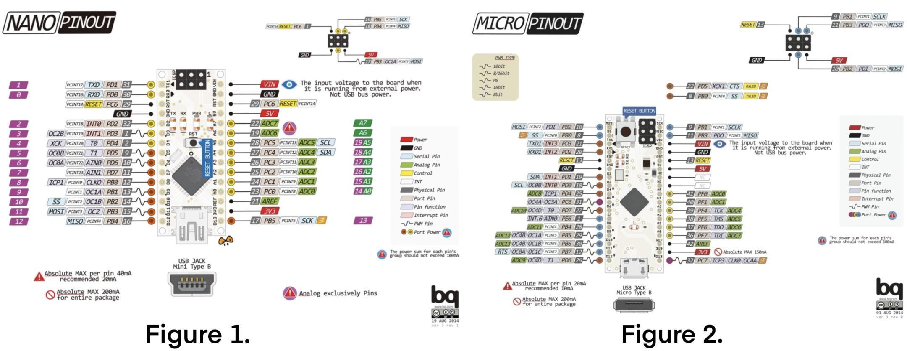
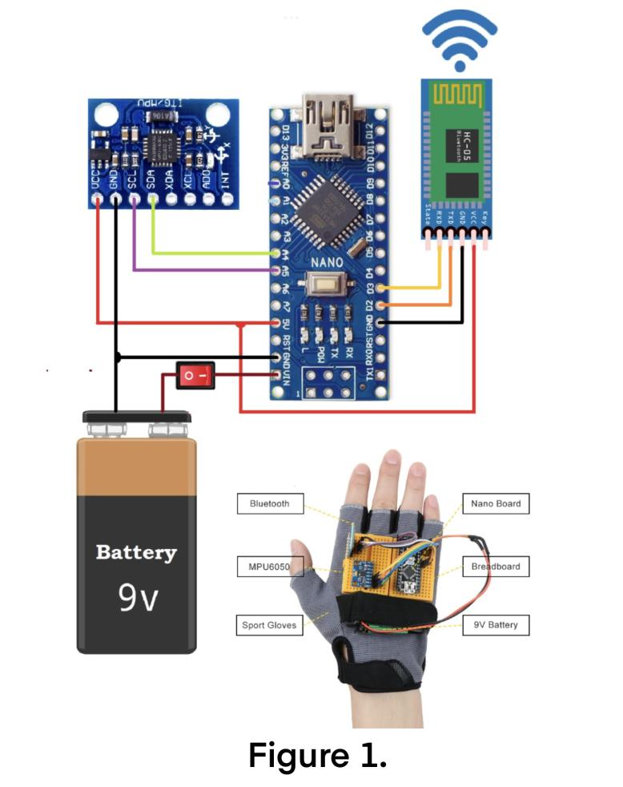

# Hand Gesture Control Robot Via Bluetooth
Replace this text with a brief description (2-3 sentences) of your project. This description should draw the reader in and make them interested in what you've built. You can include what the biggest challenges, takeaways, and triumphs from completing the project were. As you complete your portfolio, remember your audience is less familiar than you are with all that your project entails!

<!--- You should comment out all portions of your portfolio that you have not completed yet, as well as any instructions: -->
```HTML 
<!--- This is an HTML comment in Markdown -->
<!--- Anything between these symbols will not render on the published site -->
```

| **Engineer** | **School** | **Area of Interest** | **Grade** |
|:--:|:--:|:--:|:--:|
| Michelle W. | The Bronx High School of Science | Computer Science | Senior

<!--- **Replace the BlueStamp logo below with an image of yourself and your completed project. Follow the guide [here](https://tomcam.github.io/least-github-pages/adding-images-github-pages-site.html) if you need help.** -->


  
<!---# Final Milestone

**Don't forget to replace the text below with the embedding for your milestone video. Go to Youtube, click Share -> Embed, and copy and paste the code to replace what's below.**

<iframe width="560" height="315" src="https://www.youtube.com/embed/F7M7imOVGug" title="YouTube video player" frameborder="0" allow="accelerometer; autoplay; clipboard-write; encrypted-media; gyroscope; picture-in-picture; web-share" allowfullscreen></iframe>

For your final milestone, explain the outcome of your project. Key details to include are:
- What you've accomplished since your previous milestone
- What your biggest challenges and triumphs were at BSE
- A summary of key topics you learned about
- What you hope to learn in the future after everything you've learned at BSE -->


<!--- # Second Milestone

**Don't forget to replace the text below with the embedding for your milestone video. Go to Youtube, click Share -> Embed, and copy and paste the code to replace what's below.**

<iframe width="560" height="315" src="https://www.youtube.com/embed/y3VAmNlER5Y" title="YouTube video player" frameborder="0" allow="accelerometer; autoplay; clipboard-write; encrypted-media; gyroscope; picture-in-picture; web-share" allowfullscreen></iframe>

For your second milestone, explain what you've worked on since your previous milestone. You can highlight:
- Technical details of what you've accomplished and how they contribute to the final goal
- What has been surprising about the project so far
- Previous challenges you faced that you overcame
- What needs to be completed before your final milestone -->

# First Milestone

<iframe width="560" height="315" src="https://www.youtube.com/embed/YDUDkDlO_pc" title="YouTube video player" frameborder="0" allow="accelerometer; autoplay; clipboard-write; encrypted-media; gyroscope; picture-in-picture; web-share" allowfullscreen></iframe>



  In my first milestone, I worked with the Arduino Micro and an accelerometer as my main components to establish a reliable and accurate connection. Initially, I wired the breadboard according to Figure 1 in "Schematics" below. However, immediately upon attempting to retrieve data from the serial monitor, I encountered a consistent timeout message indicating an inability to establish a connection.

  Further research helped us realize that the schematic I followed was intended for an Arduino Nano (figure 1 on the left), whereas I was using an Arduino Micro (figure 2 on the right). Fortunately, this was an easy fix and I compared the pinouts of the two boards, making the necessary adjustments to my wiring. The biggest issue being that certain pins overlapped, forcing me to modify certain pin numbers in my code. 

  I encountered no further issues as I reconnected the Arduino to the power source, opened up the serial monitor once more, and was able to obtain consistent and updated values for X, Y, and Z from the accelerometer. The X and Y values would be used to detect specific gestures (forward, backward, left, or right) and subsequently, the corresponding commands would be sent to the Bluetooth module, allowing me to be able to control the robot car in the near future.
  
# Schematics 



# Code

```c++
#include <SoftwareSerial.h>
SoftwareSerial BT_Serial(7, 8); // RX, TX

#include <Wire.h> // I2C communication library

const int MPU = 0x68; // I2C address of the MPU6050 accelerometer
int16_t AcX, AcY, AcZ;

int flag=0;

void setup () {// put your setup code here, to run once

Serial.begin(9600); // start serial communication at 9600bps
BT_Serial.begin(9600); 

// Initialize interface to the MPU6050
Wire.begin();
Wire.beginTransmission(MPU);
Wire.write(0x6B);
Wire.write(0);
Wire.endTransmission(true);

delay(500); 
}

void loop () {
Read_accelerometer(); // Read MPU6050 accelerometer

if(AcX<60  && flag==0){flag=1; BT_Serial.write('f');}
if(AcX>130 && flag==0){flag=1; BT_Serial.write('b');}
      
if(AcY<60  && flag==0){flag=1; BT_Serial.write('l'); }
if(AcY>130 && flag==0){flag=1; BT_Serial.write('r');}
  
if((AcX>70)&&(AcX<120)&&(AcY>70)&&(AcY<120)&&(flag==1)){flag=0;
BT_Serial.write('s');
}

delay(100);  
}

void Read_accelerometer(){
      // Read the accelerometer data
Wire.beginTransmission(MPU);
Wire.write(0x3B); // Start with register 0x3B (ACCEL_XOUT_H)
Wire.endTransmission(false);
Wire.requestFrom(MPU, 6, true); // Read 6 registers total, each axis value is stored in 2 registers

AcX = Wire.read() << 8 | Wire.read(); // X-axis value
AcY = Wire.read() << 8 | Wire.read(); // Y-axis value
AcZ = Wire.read() << 8 | Wire.read(); // Z-axis value

AcX = map(AcX, -17000, 17000, 0, 180);
AcY = map(AcY, -17000, 17000, 0, 180);
AcZ = map(AcZ, -17000, 17000, 0, 180);

Serial.print(AcX);
Serial.print("\t");
Serial.print(AcY);
Serial.print("\t");
Serial.println(AcZ); 
}
```

# Bill of Materials
Here's where you'll list the parts in your project. To add more rows, just copy and paste the example rows below.
Don't forget to place the link of where to buy each component inside the quotation marks in the corresponding row after href =. Follow the guide [here]([url](https://www.markdownguide.org/extended-syntax/)) to learn how to customize this to your project needs. 

| **Part** | **Note** | **Price** | **Link** |
|:--:|:--:|:--:|:--:|
| MakerFocus DIY Robot Car Smart Chassis Kit | Basic pieces for the structure of the car | $17.99 | <a href="https://www.amazon.com/MakerFocus-Chassis-MEGA2560-MEGA1280-Microcontroller/dp/B01LYZDP9U"> Link </a> |
| Item Name | What the item is used for | $Price | <a href="https://www.amazon.com/Arduino-A000066-ARDUINO-UNO-R3/dp/B008GRTSV6/"> Link </a> |
| Item Name | What the item is used for | $Price | <a href="https://www.amazon.com/Arduino-A000066-ARDUINO-UNO-R3/dp/B008GRTSV6/"> Link </a> |
| Item Name | What the item is used for | $Price | <a href="https://www.amazon.com/Arduino-A000066-ARDUINO-UNO-R3/dp/B008GRTSV6/"> Link </a> |
| Item Name | What the item is used for | $Price | <a href="https://www.amazon.com/Arduino-A000066-ARDUINO-UNO-R3/dp/B008GRTSV6/"> Link </a> |
| Item Name | What the item is used for | $Price | <a href="https://www.amazon.com/Arduino-A000066-ARDUINO-UNO-R3/dp/B008GRTSV6/"> Link </a> |
| Item Name | What the item is used for | $Price | <a href="https://www.amazon.com/Arduino-A000066-ARDUINO-UNO-R3/dp/B008GRTSV6/"> Link </a> |

<!--- Other Resources/Examples
One of the best parts about Github is that you can view how other people set up their own work. Here are some past BSE portfolios that are awesome examples. You can view how they set up their portfolio, and you can view their index.md files to understand how they implemented different portfolio components.
- [Example 1](https://trashytuber.github.io/YimingJiaBlueStamp/)
- [Example 2](https://sviatil0.github.io/Sviatoslav_BSE/)
- [Example 3](https://arneshkumar.github.io/arneshbluestamp/)

To watch the BSE tutorial on how to create a portfolio, click here. -->
